# Arhitectura eSC

Diagrame proiect Tehnologii Web.

---

## 1. Context — cine foloseste aplicatia

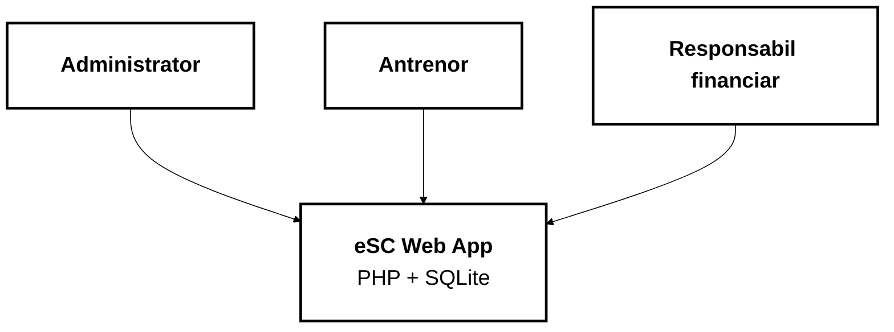

---

## 2. Containere — Browser si Server

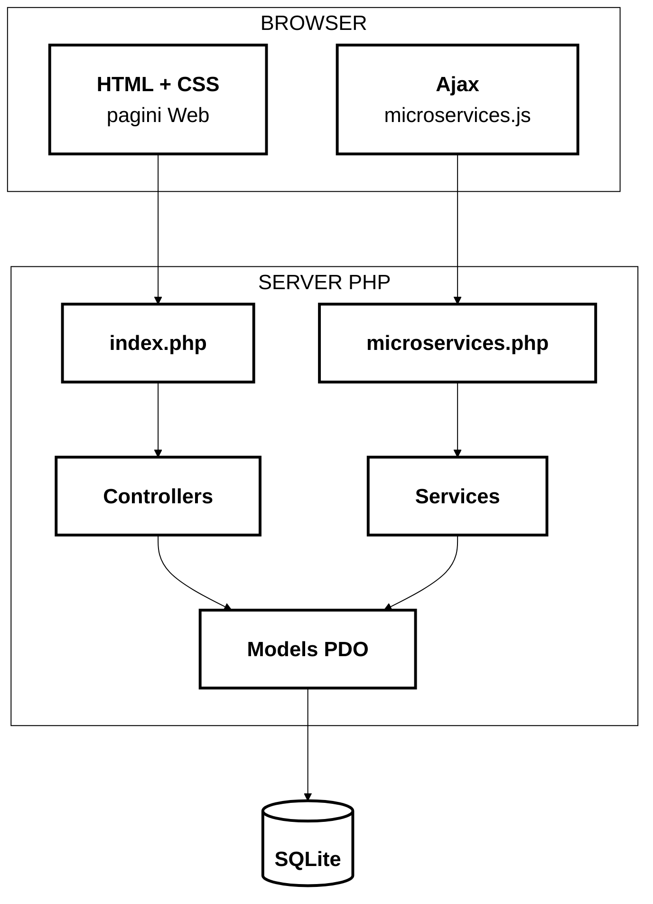

---

## 3. Flux pagina Web — request clasic

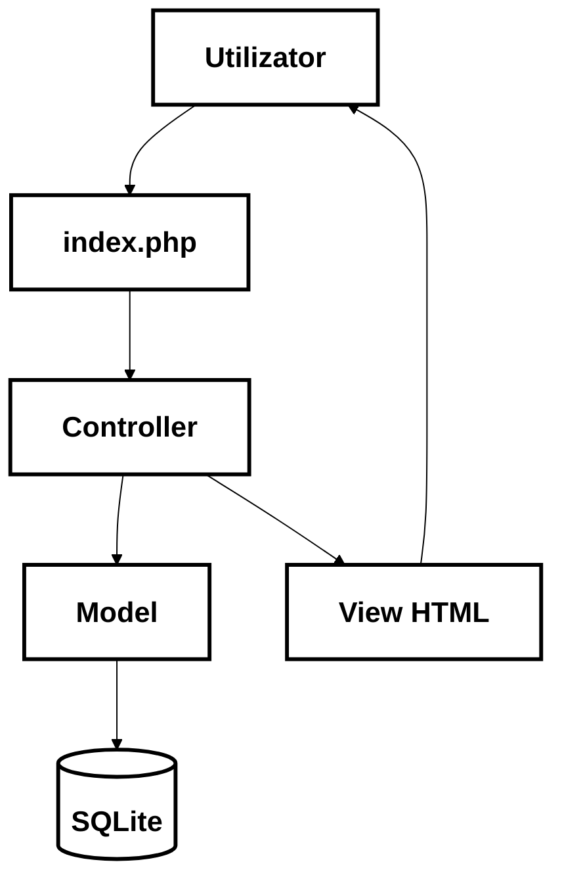

---

## 4. Flux Ajax

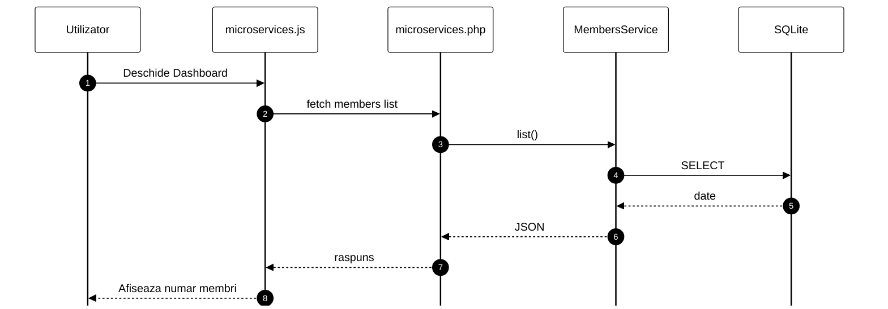

---

## 5. Plugin-uri si micro-servicii

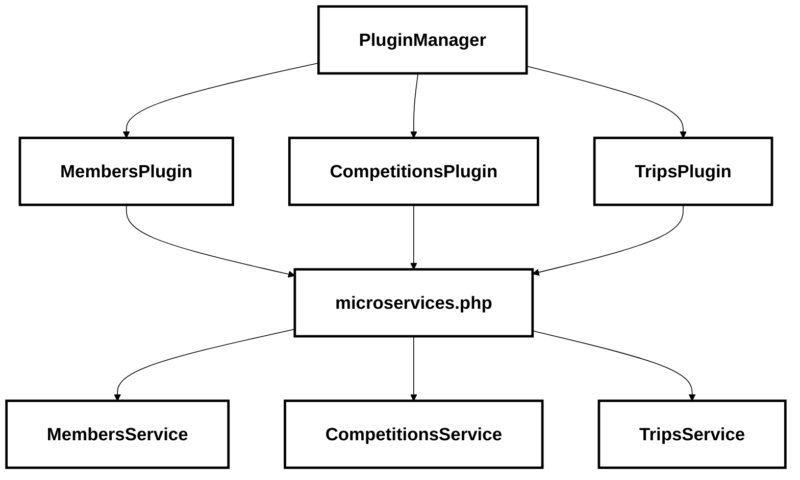

---

## 6. Baza de date — utilizatori si roluri

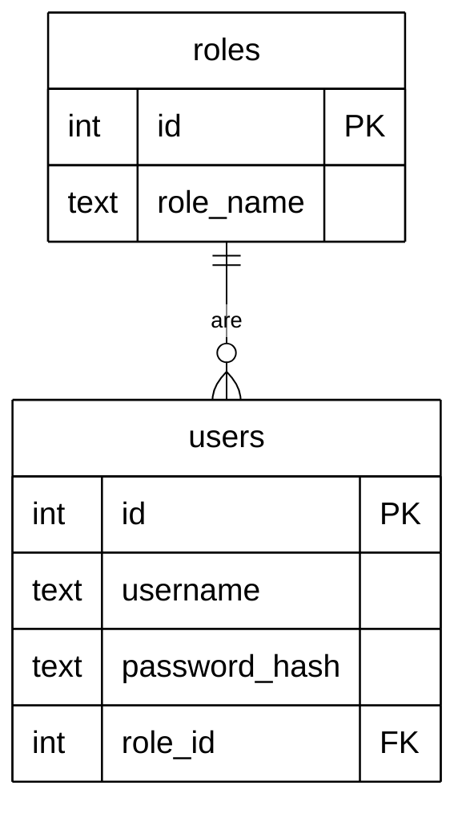

---

## 7. Baza de date — membri si antrenori

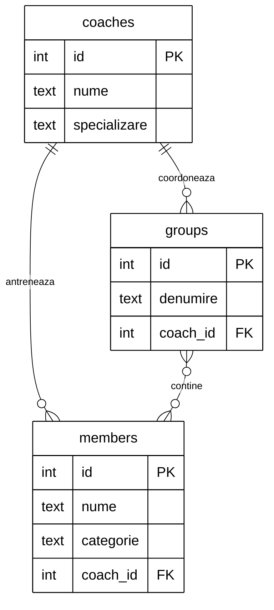

---

## 8. Baza de date — competitii si premii

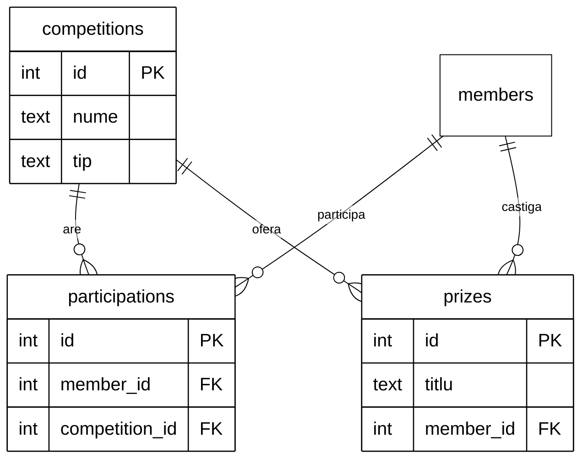

---

## 9. Baza de date — deplasari si cheltuieli

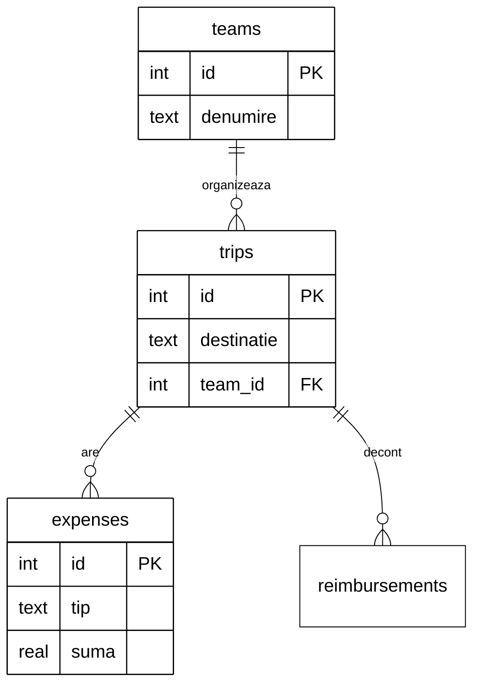

---

## 10. Autentificare si acces pe roluri

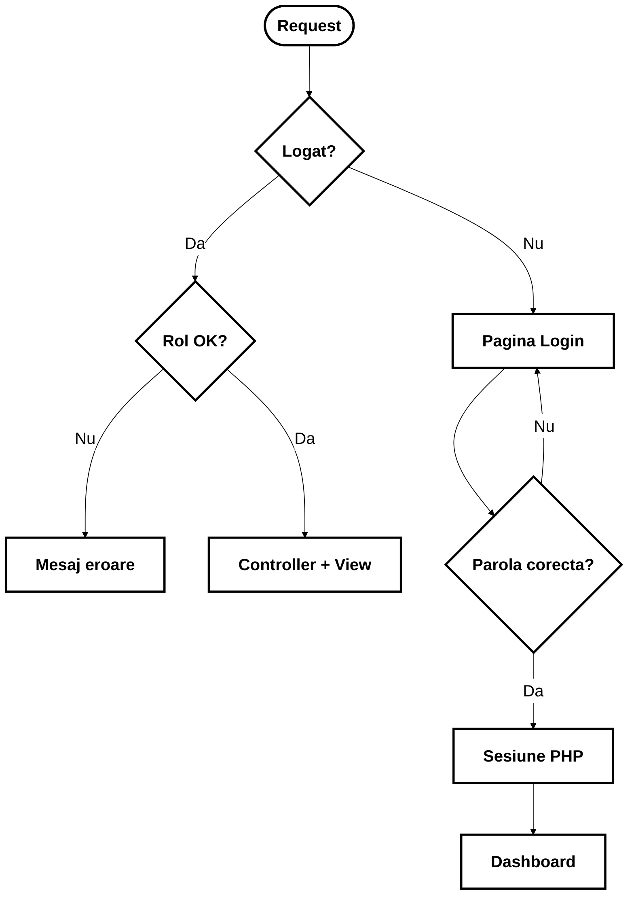

---

## 11. Etape proiect (timeline)

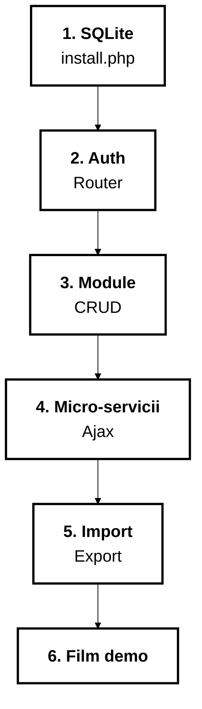
