# Arhitectură eSC — Model C4

SPA + API REST PHP, fără SSR. Cerințe: [web-projects.html](https://edu.info.uaic.ro/web-technologies/web-projects.html)

---

## 1. Context (C4 — nivel 1)

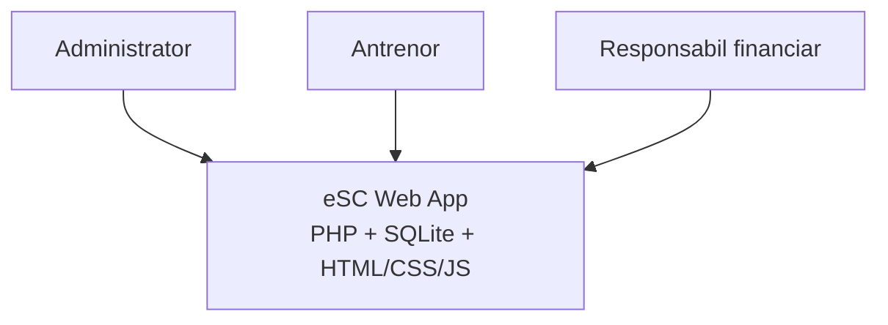

---

## 2. Containere (C4 — nivel 2)

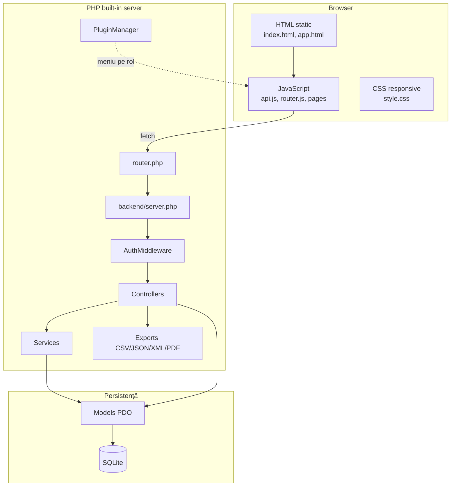

---

## 3. Componente backend (C4 — nivel 3)

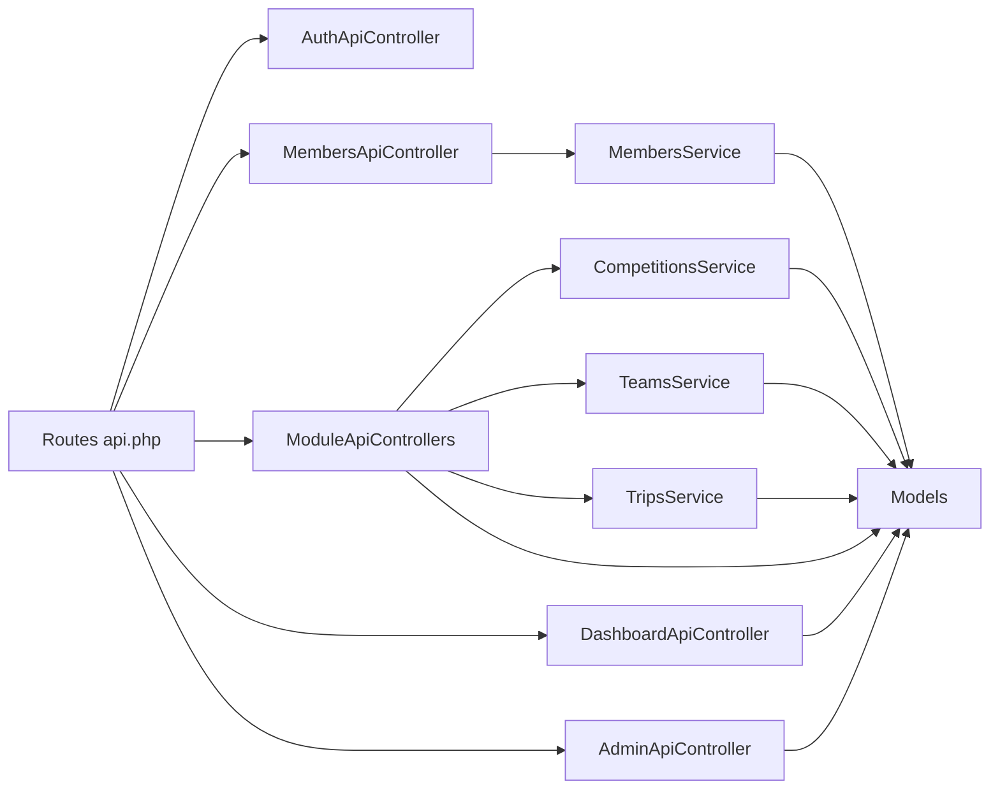

---

## 4. Flux încărcare aplicație

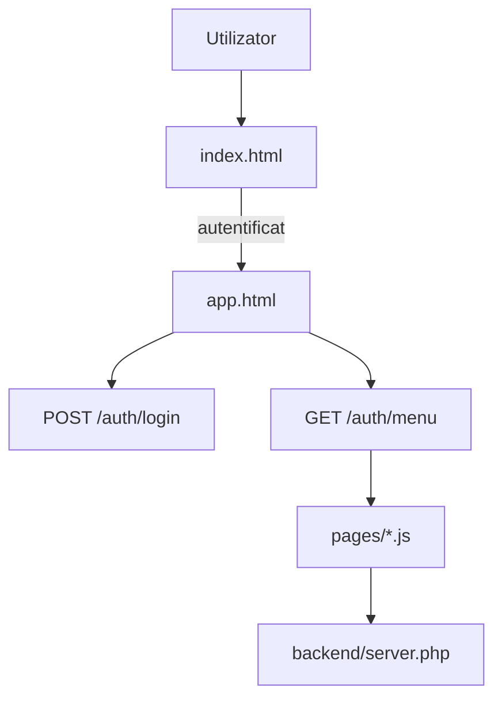

---

## 5. Flux Ajax (exemplu: membri)

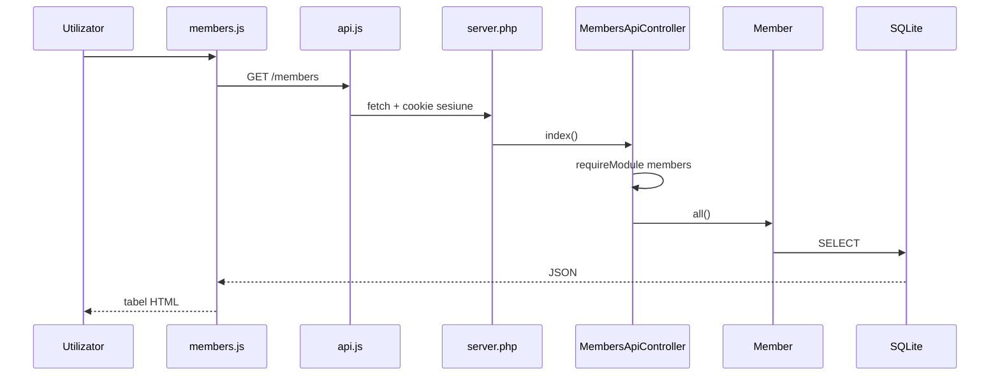

---

## 6. Module (15 plugin-uri)

Fiecare modul are un plugin în `backend/plugins/modules/`. Accesul pe rol: `backend/config/app.php`.

Dashboard, Members, Coaches, Teams, Groups, Halls, Activities, Competitions, Participations, Rankings, Prizes, Trips, Expenses, Reimbursements, Admin.

Modulul *reimbursements* agregă date din `trips`, `expenses`, `trip_members` (fără tabel propriu).

---

## 7. Autentificare și roluri

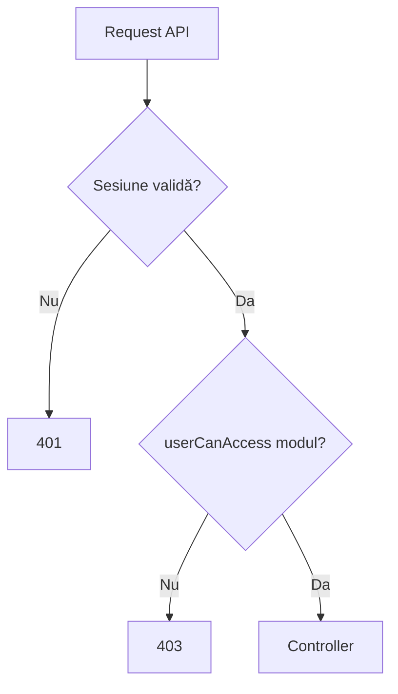

---

## 8. ER — utilizatori

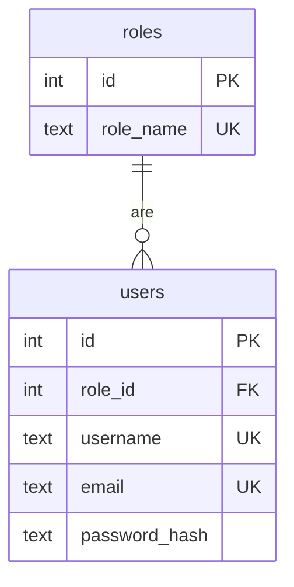

---

## 9. ER — antrenori, membri, grupe

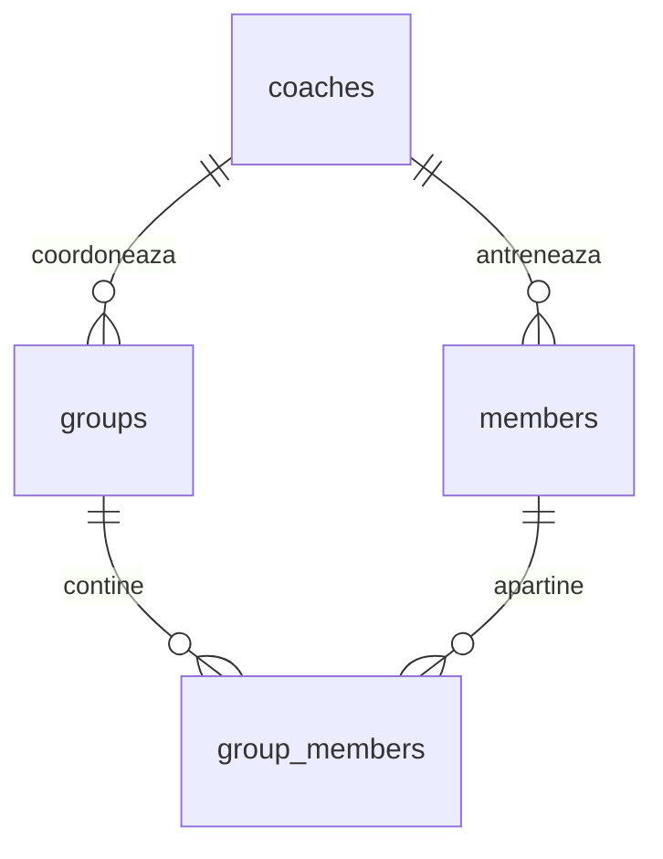

---

## 10. ER — săli și activități

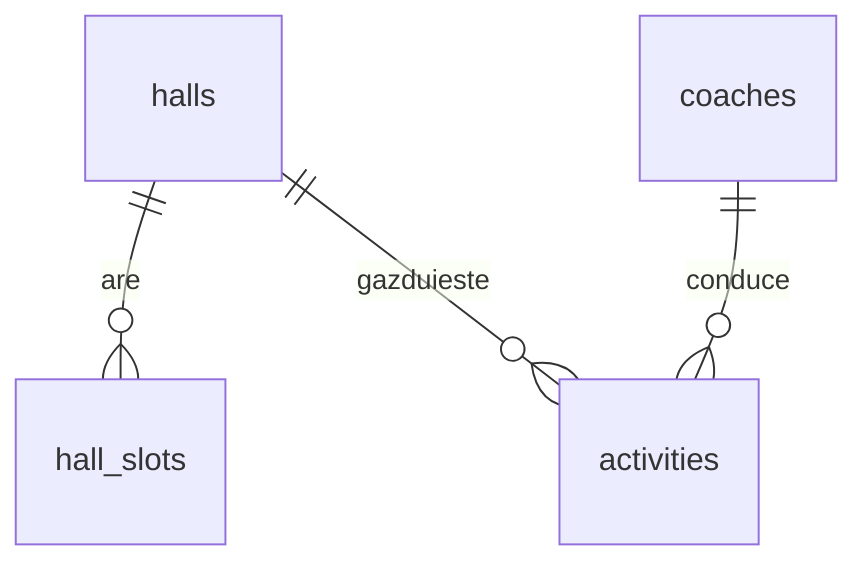

Conflicte la programare: `Activity::hasHallConflict()`, `Activity::hasCoachConflict()`.

---

## 11. ER — echipe și competiții

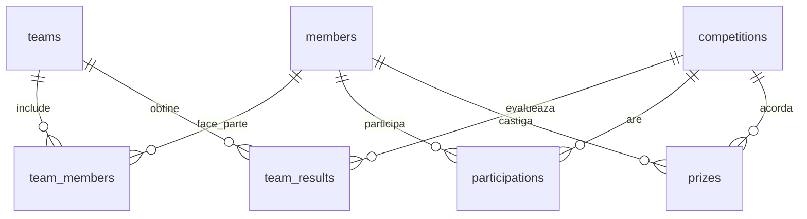

---

## 12. ER — deplasări

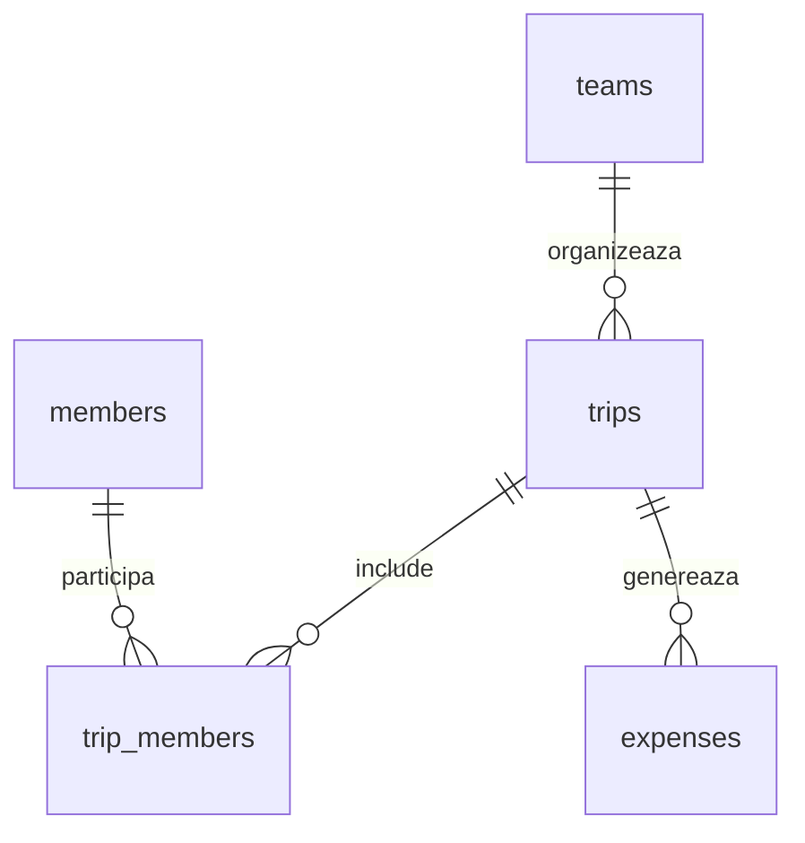

---

## 13. Etape dezvoltare

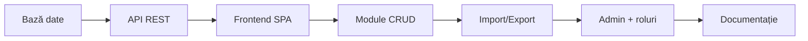

| Etapă | Conținut |
|-------|----------|
| 1 | `database.sql`, `install.php` |
| 2 | `server.php`, Router, Auth |
| 3 | `app.html`, hash router |
| 4 | 15 plugin-uri |
| 5 | CSV, JSON, XML, PDF |
| 6 | `AdminApiController`, permisiuni |
| 7 | RAPORT, diagrame, film |

---

## Fișiere cheie

| Strat | Cale |
|-------|------|
| Entry | `router.php`, `backend/server.php` |
| Rute | `backend/routes/api.php` |
| Securitate | `backend/middleware/AuthMiddleware.php` |
| Roluri | `backend/config/app.php` |
| Client | `frontend/js/api.js`, `frontend/js/router.js` |
| Schema | `database/schema/database.sql` |
