# Arhitectură eSC — Model C4

SPA + API REST PHP stateless (JWT), fără SSR. Cerințe: [web-projects.html](https://edu.info.uaic.ro/web-technologies/web-projects.html)

---

## 1. Context (C4 — nivel 1)

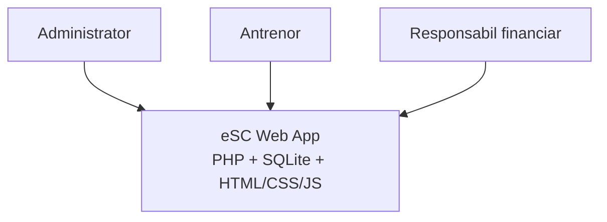

---

## 2. Containere (C4 — nivel 2)

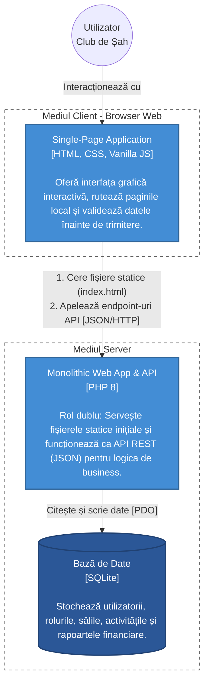

---

## 3. Componente backend (C4 — nivel 3)

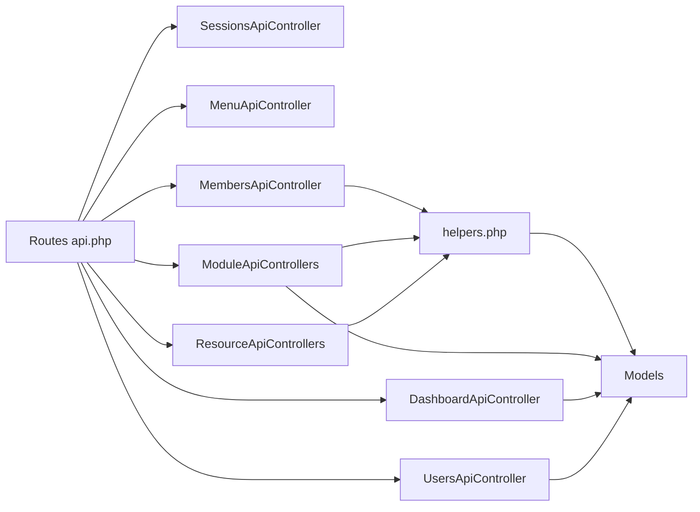

---

## 4. Flux încărcare aplicație

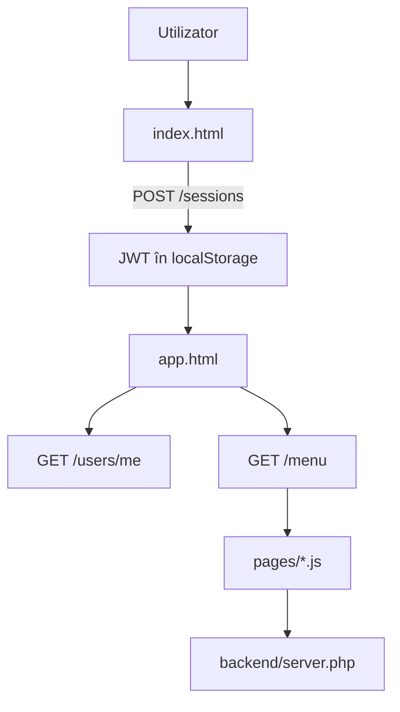

---

## 5. Flux Ajax (exemplu: membri)

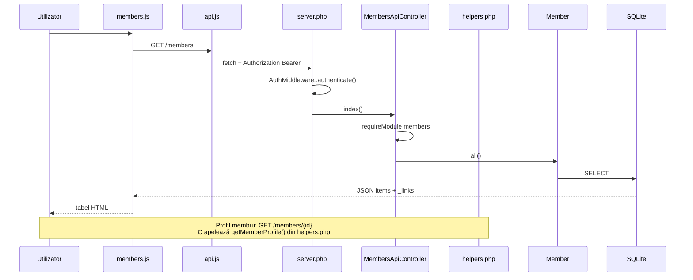

---

## 6. Module (15 module UI)

Lista modulelor este definită în `$MENU_ITEMS` din `backend/config/app.php`. Accesul pe rol: `$ROLE_PERMISSIONS` + `userCanAccess()`. Meniul API: `MenuApiController` filtrează elementele după rol.

Dashboard, Members, Coaches, Teams, Groups, Halls, Activities, Competitions, Participations, Rankings, Prizes, Trips, Expenses, Reimbursements, Admin.

Modulul *reimbursements* agregă date din `trips`, `expenses`, `trip_members` (fără tabel propriu). Raportul este construit cu `getTripReport()` din `helpers.php`.

---

## 7. Autentificare și roluri

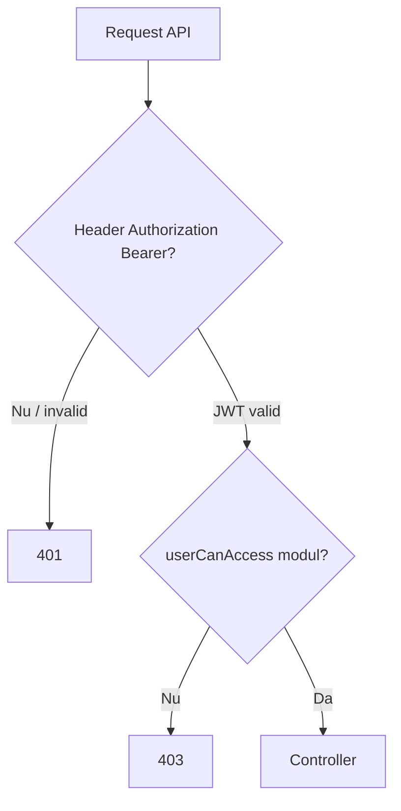

Autentificare **stateless**: `JwtService` (HS256) emite token la `POST /sessions`; clientul îl trimite la fiecare cerere. Fără `session_start()` sau cookie de sesiune.

| Resursă | Metodă | Rol |
|---------|--------|-----|
| `/sessions` | POST | Login public → `access_token` |
| `/sessions` | DELETE | Logout (client șterge tokenul) |
| `/users` | POST | Înregistrare publică sau creare admin |
| `/users/me` | GET | Utilizator curent |
| `/users` | GET | Listă utilizatori (admin) |
| `/users/{id}` | PUT / DELETE | Rol / ștergere (admin) |
| `/roles` | GET | Roluri disponibile (admin) |
| `/menu` | GET | Elemente meniu filtrate pe rol |

---

## 7b. Convenții API REST

- **Resurse** ca URI-uri la plural (`/members`, `/teams/{id}/members`)
- **Verbe HTTP**: GET (citire), POST (creare → 201 + `Location`), PUT (actualizare → 200), DELETE (ștergere → 204)
- **Reprezentări** JSON directe, fără envelope `{ success, data }`
- **Erori** RFC 7807: `{ type, title, status, detail }`
- **HATEOAS**: câmp `_links` pe resurse și colecții (`RestHelper`, `Hateoas`)
- **Export**: query `?format=csv|json|xml` pe colecții; PDF pe deconturi (`GET /reimbursements/{id}/export?format=pdf`)

Funcția `exportList()` din `helpers.php` centralizează exportul CSV/JSON/XML pentru rapoarte participări și clasamente.

---

## 8. ER — utilizatori

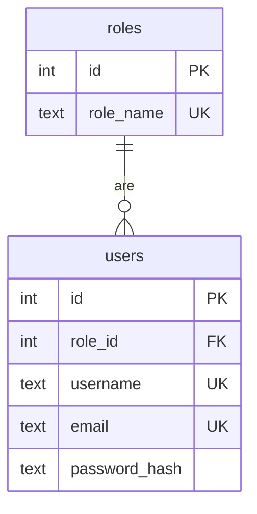

---

## 9. ER — antrenori, membri, grupe

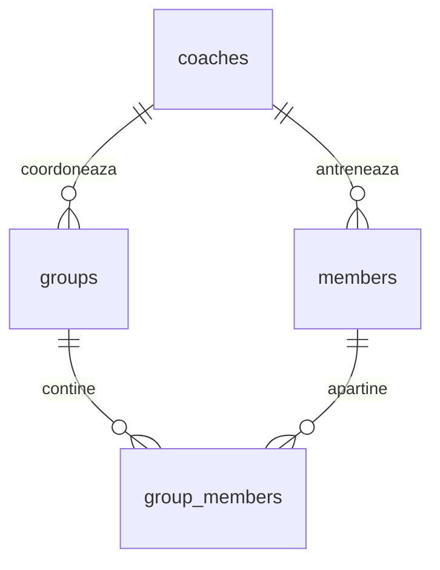

---

## 10. ER — săli și activități

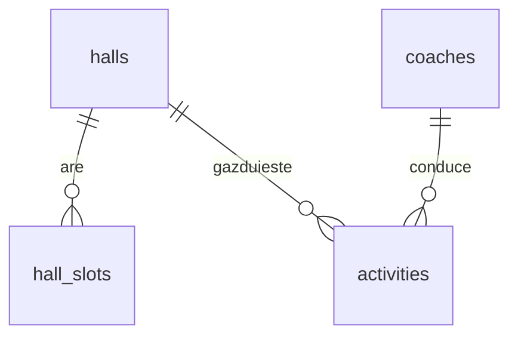

Conflicte la programare: `Activity::hasHallConflict()`, `Activity::hasCoachConflict()`.

---

## 11. ER — echipe și competiții

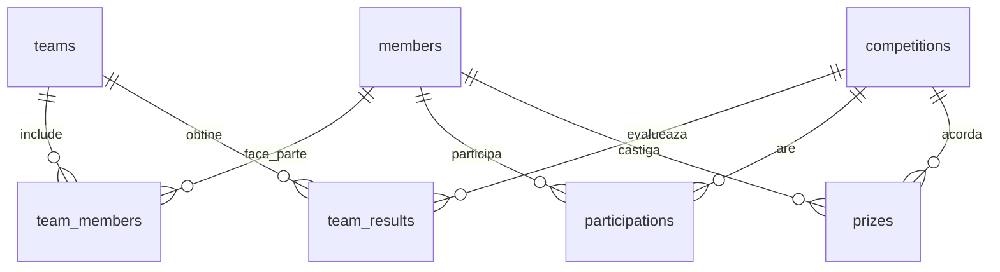

---

## 12. ER — deplasări

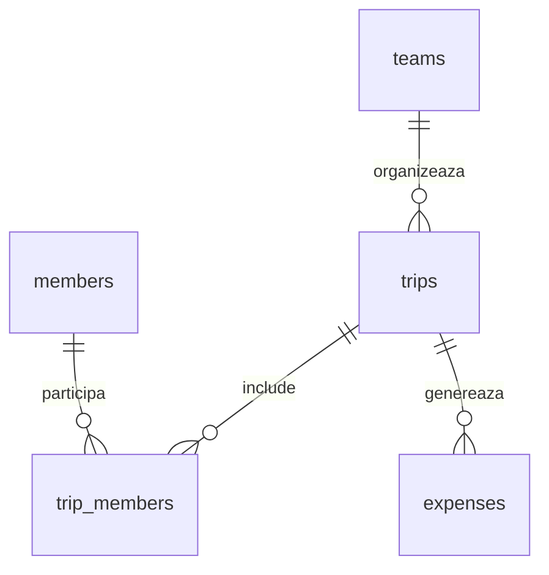

---

## 13. Etape dezvoltare

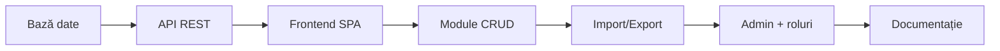

| Etapă | Conținut |
|-------|----------|
| 1 | `database.sql`, `install.php` |
| 2 | `server.php`, Router, JWT, Auth |
| 3 | `app.html`, hash router |
| 4 | 15 module CRUD (controllers + pages) |
| 5 | CSV, JSON, XML, PDF |
| 6 | `UsersApiController`, permisiuni în `app.php` |
| 7 | RAPORT, diagrame, film |

---

## Fișiere cheie

| Strat | Cale |
|-------|------|
| Entry | `router.php`, `backend/server.php` |
| Rute | `backend/routes/api.php` |
| Securitate | `backend/middleware/AuthMiddleware.php`, `backend/services/JwtService.php` |
| Config + meniu + roluri | `backend/config/app.php` |
| Funcții reutilizabile | `backend/helpers.php` |
| REST helpers | `backend/utils/Response.php`, `Hateoas.php`, `RestHelper.php` |
| Export | `backend/exports/DataExporter.php`, `PdfExporter.php` |
| Client | `frontend/js/api.js`, `frontend/js/router.js`, `frontend/js/utils.js` |
| Schema | `database/schema/database.sql` |
